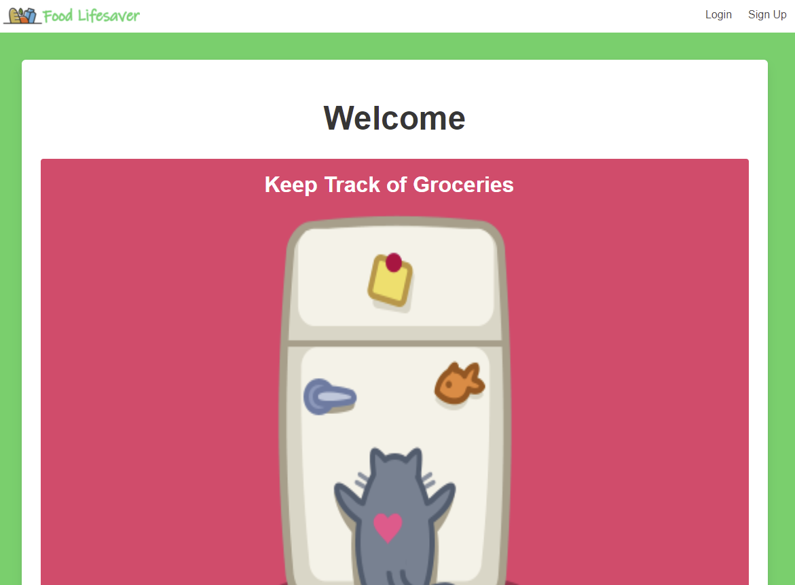
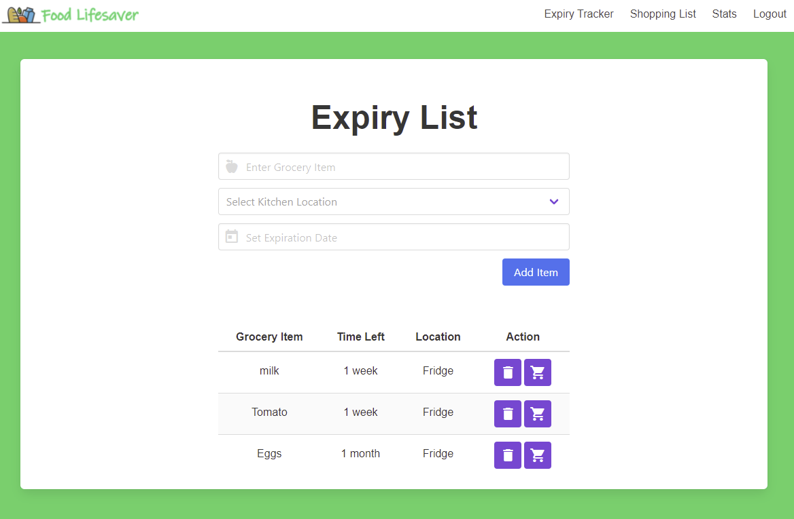

# Food LifeSaver

## Description
This application is an Expiry Tracker and a Shopping List Application built using MongoDB, Express, Vue and Node. Buefy is the CSS Framework. The motivation behind this project is primary to learn how to use the Vue.JS framework. In addition, I always wanted to address the problem of remembering what foods I have. 

* Link to the app on Heroku: https://food-lifesaver.herokuapp.com/
* Link to the Github repository: https://github.com/akwanmtl/expiry-tracker

## Table of Contents

* [Usage](#usage)
* [Credits](#credits)
* [License](#license)

## Usage 

Here is a demo of the application:

When you first land on the page, you are welcome with a simple landing page. Login is required to gain access to Food Lifesaver. 

Once logged in, you can start tracking your food items to make sure that they don't expire. 

There is also a shopping list feature. Once you finish a food item, you can either remove it from the expiry list or add it to your shopping cart. There is also a simple stats page to show you how much food you have wasted vs finished.  

## Credits
* [License badge link](https://gist.github.com/lukas-h/2a5d00690736b4c3a7ba)

## License

Copyright (c) [2021] [Annie Kwan]
